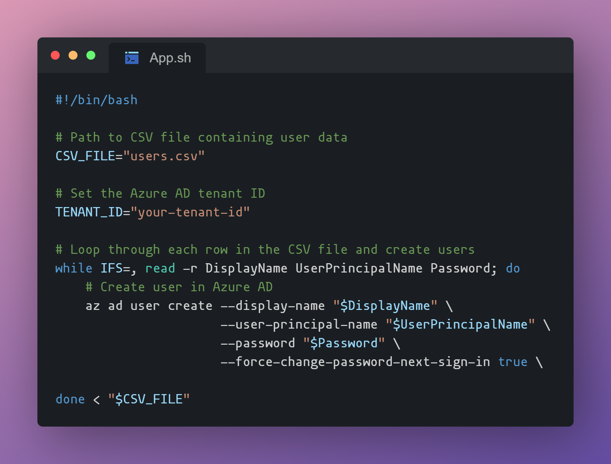

  <h1 align="center"> Azure Bulk User Creation CLI</h1>
  
A bash script to create multiple users in Azure Active Directory using Azure CLI

    

## Prerequisites

- [An Azure subscription. Create one for free.](azure.com/free)

## How to setup

1. Clone the code.
2. Move into the directory.
3. [Terminal] To run the script use ./UserCreation.sh

## How to use

1. Input selected users into the "UserCreateTemplate.csv" file
2. Change the CSV file path to "UserCreateTemplate.csv"
3. Input your desired Azure Entra Tenant ID
4. Run the bash script

## Contributing

Feel free to open up an issue or reach out to me with.

- **Travis Gray**: [Linkedin](https://linkedin.com/in/tg12)
